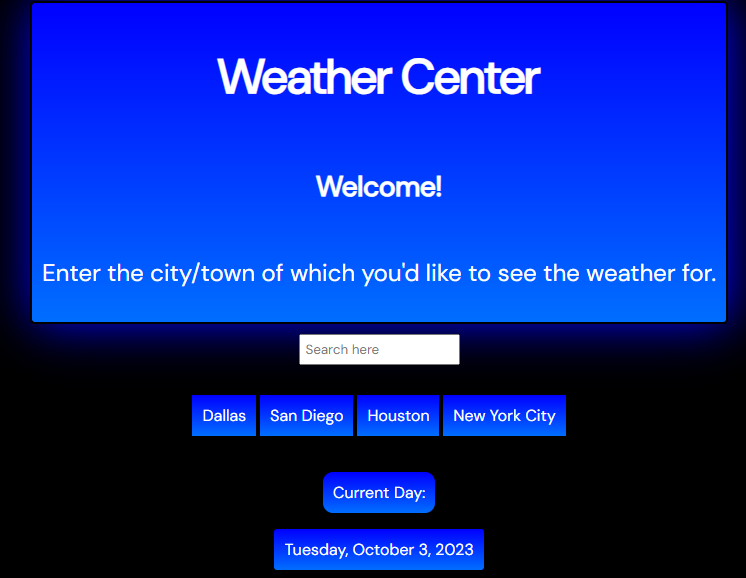

# weather-app

## Description

An app that utilizes the OpenWeatherMap API to display weather data for different cities around the world.

## Installation

This application will run within any modern browser.

## Usage

This app utilizes GitHub Pages in order to run, a link will be included in this README.

Type in your desired city to see the weather for in the "Search here" bar: 

Upon searching, data for the current weather in the searched location will display.

## Credits

OpenWeatherMap API Documentation: https://openweathermap.org/forecast5

